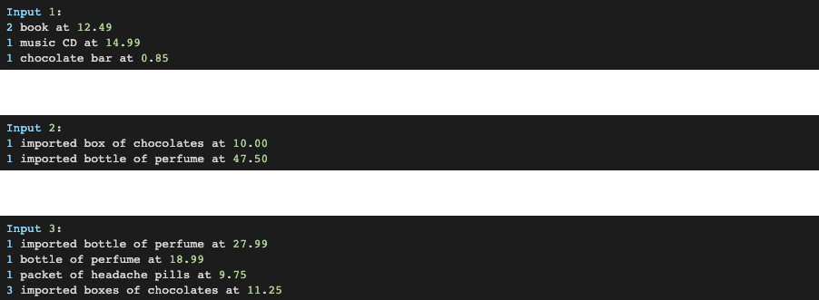

# Torc_THP_Receipt

## 📋 Description

This is a take-home project, it is implemented in Ruby, it has test cases using RSPEC, and the data are already loaded.

## ✅  Instructions to Run it on Your Local Machine
​
To have a version on you local machine:
- Clone this repository.
- Open a terminal on the containing folder of this project.
- If you want to test it, run in the console: 
> rspec
- If you want to run it, run in the console:
> ruby main.rb

## 🎯 Problem Statement

This problem requires some kind of input. You are free to implement any mechanism for feeding the input into your solution. You should provide sufficient evidence that your solution is complete by, as a minimum, indicating that it works correctly against the supplied test data.

Basic sales tax is applicable at a rate of 10% on all goods, except books, food, and medical products that are exempt. Import duty is an additional sales tax applicable on all imported goods at a rate of 5%, with no exemptions.

When I purchase items I receive a receipt which lists the name of all the items and their price (including tax), finishing with the total cost of the items, and the total amounts of sales taxes paid. The rounding rules for sales tax are that for a tax rate of n%, a shelf price of p contains (np/100 rounded up to the nearest 0.05) amount of sales tax.

Write an application that prints out the receipt details for these shopping baskets:

Input

## Author

🎨 **Jasem Valencia**

- Github: [@JasemDuncan](https://github.com/JasemDuncan)
- Twitter: [@JasemValencia](https://twitter.com/JasemValencia)
- Linkedin: [@JasemDuncan](www.linkedin.com/in/Jasem-Duncan-Valencia)

## 🤝 Contributing

    Contributions, issues and feature requests are welcome!

Feel free to check the [issues page](https://github.com/JasemDuncan/Torc_THP_Receipt/issues).

## Show your support

Give a ⭐️ if you like this project!

## 📝 License
This project is [MIT](lic.url) licensed.
This project is for Educational purposes.